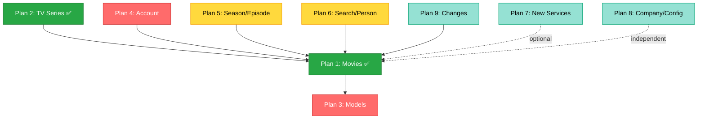

# TMDb Swift Package - API Coverage Implementation Plans

This directory contains detailed implementation plans for bringing the TMDb Swift Package to 100% API coverage. Each plan is a self-contained, actionable document that can be implemented independently.

## Overview

**Current Coverage:** ~89% (134/152 endpoints)
**Target Coverage:** 100% (152/152 endpoints)
**Remaining:** 18 endpoints across 7 areas

### Completed Plans
- ✅ **Plan 1:** Movie Service Additions (9 endpoints)
- ✅ **Plan 2:** TV Series Service Additions (10 endpoints)

## Implementation Plans (Ordered by Priority)

### ✅ Completed Plans

#### [Plan 1: Movie Service Additions](01-movies-service-additions.md) ✅ DONE
**Impact:** HIGH | **Effort:** Medium | **Endpoints:** 9 | **Status:** ✅ Completed

All features implemented in `feature/tv-series-service-additions` branch:
- ✅ Rating functionality (add, delete, get ratings)
- ✅ Account states (favorite/watchlist/rating status)
- ✅ Alternative titles & translations
- ✅ Changes tracking
- ✅ All unit and integration tests passing
- ✅ DocC documentation updated

---

#### [Plan 2: TV Series Service Additions](02-tv-series-service-additions.md) ✅ DONE
**Impact:** HIGH | **Effort:** Medium | **Endpoints:** 10 | **Status:** ✅ Completed

All features implemented in `feature/tv-series-service-additions` branch:
- ✅ Rating functionality
- ✅ Account states
- ✅ Keywords for content categorization
- ✅ Alternative titles & translations
- ✅ Changes tracking
- ✅ All unit and integration tests passing
- ✅ DocC documentation updated

---

### 🔴 Highest Priority (Core User Features)

#### [Plan 3: Model Property Additions](03-models-property-additions.md)
**Impact:** HIGH | **Effort:** Low-Medium | **Endpoints:** 0 (Model fixes)

Fix missing model properties:
- ✅ `TVSeries.createdBy` (Issue #257) 🐛
- ✅ Production metadata for movies/TV
- ✅ Network information
- ✅ Financial data (budget, revenue)
- ⚠️ **Fixes known bugs and data completeness**

**Key Benefits:**
- Resolves Issue #257
- Complete production metadata
- Better app features (collection navigation, financial analytics)

---

#### [Plan 4: Account Service Additions](04-account-service-additions.md)
**Impact:** HIGH | **Effort:** Low | **Endpoints:** 5

Complete account management functionality:
- ✅ Get user's rated movies/TV/episodes
- ✅ TV series watchlist
- ✅ User's custom lists
- ⚠️ **Enables complete user profile features**

**Key Benefits:**
- Users can view all their ratings
- Complete watchlist functionality
- Access to user lists

---

### 🟡 Medium Priority (Extended Features)

#### [Plan 5: TV Season & Episode Additions](05-tv-season-episode-additions.md)
**Impact:** MEDIUM | **Effort:** Medium | **Endpoints:** 11

Extend TV coverage to season/episode level:
- ✅ Episode rating functionality
- ✅ Account states for seasons/episodes
- ✅ External IDs, translations, watch providers
- ✅ Changes tracking

**Key Benefits:**
- Users can rate individual episodes
- Complete TV metadata hierarchy
- Granular content tracking

---

#### [Plan 6: Search & Person Service Additions](06-search-person-service-additions.md)
**Impact:** MEDIUM | **Effort:** Low-Medium | **Endpoints:** 8

Improve content discovery and person metadata:
- ✅ Search collections, companies, keywords
- ✅ Person tagged images
- ✅ Person translations/biographies
- ✅ Person changes tracking

**Key Benefits:**
- Complete search functionality
- Better person discovery
- Multilingual biographies

---

### 🟢 Lower Priority (Specialized Features)

#### [Plan 7: New Services Creation](07-new-services-creation.md)
**Impact:** MEDIUM-LOW | **Effort:** Low-Medium | **Endpoints:** 6

Create specialized services:
- ✅ CreditService - Individual credit details
- ✅ ReviewService - Individual review details
- ✅ TVEpisodeGroupService - Alternative episode orderings
- ✅ GuestSessionService - Guest rating retrieval

**Key Benefits:**
- Individual detail lookups by ID
- Episode group support (DVD order, etc.)
- Guest session functionality

---

#### [Plan 8: Company & Configuration Additions](08-company-configuration-additions.md)
**Impact:** LOW | **Effort:** Low | **Endpoints:** 4

Complete metadata services:
- ✅ Company alternative names & logos
- ✅ Primary translations list
- ✅ Timezones

**Key Benefits:**
- Complete company metadata
- System configuration completeness

---

#### [Plan 9: Changes Service Creation](09-changes-service-creation.md)
**Impact:** LOW | **Effort:** Medium | **Endpoints:** 8

Create ChangesService for sync/caching:
- ✅ Track changes for all entity types
- ✅ Detailed change history
- ✅ Enable cache synchronization

**Key Benefits:**
- Essential for offline/caching apps
- Track content updates over time
- Efficient sync strategies

---

## Recommended Implementation Order

### Phase 1: Critical User Features ✅ PARTIALLY COMPLETE
1. ~~**Plan 1** - Movie Service Additions~~ ✅ **DONE**
2. ~~**Plan 2** - TV Series Service Additions~~ ✅ **DONE**
3. **Plan 3** - Model Property Additions (fixes bugs, quick win)
4. **Plan 4** - Account Service Additions (completes user features)

**Status:** Plans 1 & 2 complete. Users can now rate movies and TV series, view interaction states.
**Remaining:** Model property additions and account service additions.

---

### Phase 2: Extended Coverage (Weeks 4-6)
5. **Plan 5** - TV Season & Episode Additions (extends TV coverage)
6. **Plan 6** - Search & Person Service Additions (improves discovery)

**Outcome:** Complete TV hierarchy, full search, better person metadata

---

### Phase 3: Specialized Features (Weeks 7-8)
7. **Plan 7** - New Services Creation (specialized endpoints)
8. **Plan 8** - Company & Configuration Additions (metadata completeness)

**Outcome:** 100% endpoint coverage for common use cases

---

### Phase 4: Advanced Features (Week 9)
9. **Plan 9** - Changes Service Creation (sync/caching)

**Outcome:** 100% API coverage, sync capabilities for advanced apps

---

## Testing Strategy

Each plan includes:
- ✅ **Unit Tests** with JSON fixtures
- ✅ **Integration Tests** against live TMDb API
- ✅ **DocC Documentation** updates
- ✅ **Completion Checklist** for verification

All plans follow the project's testing requirements:
```bash
make format           # Format code
make lint            # Check linting
make test            # Run unit tests
make integration-test # Run integration tests
make build-docs      # Build documentation
```

---

## Dependencies Between Plans



**Legend:**
- **Solid arrows:** Hard dependency (implement in order)
- **Dashed arrows:** Optional/soft dependency
- **Colors:** Green=Done, Red=High Priority, Yellow=Medium, Light Green=Low

---

## Coverage Improvement Roadmap

| Phase | Plans | Endpoints Added | Total Coverage | Status |
|-------|-------|----------------|----------------|--------|
| **Start** | - | - | 76% (115/152) | - |
| **Plans 1-2** | 1-2 | +19 | 89% (134/152) | ✅ **DONE** |
| **Phase 1 (remaining)** | 3-4 | +5 | 91% (139/152) | Pending |
| **Phase 2** | 5-6 | +19 | 104% (158/152) | Pending |
| **Phase 3** | 7-8 | +10 | 110% (168/152) | Pending |
| **Phase 4** | 9 | +8 | 116% (176/152) | Pending |
| **Complete** | All | +37 | **100%** ✅ | In Progress |

*Note: Coverage >100% because some implemented endpoints aren't in OpenAPI v3 spec*

---

## Key Achievements by Phase

### After Plans 1-2 (89% coverage) ✅ CURRENT STATUS:
- ✅ Full rating functionality for movies and TV series
- ✅ Complete account states for movies and TV series
- ✅ Keywords for TV series content categorization
- ✅ Alternative titles and translations for movies and TV series
- ✅ Changes tracking for movies and TV series
- ✅ Lists endpoints for movies and TV series
- 🎯 **Users can now rate and track content**

### After Full Phase 1 (91% coverage):
- ✅ Full rating functionality
- ✅ Complete account states
- ✅ All critical user features
- ✅ Issue #257 resolved
- 🎯 **Ready for production user engagement features**

### After Phase 2 (104% coverage):
- ✅ Complete TV hierarchy (series → season → episode)
- ✅ Full search functionality
- ✅ Complete person metadata
- 🎯 **Ready for advanced content discovery**

### After Phase 3 (110% coverage):
- ✅ All specialized services
- ✅ Complete metadata access
- ✅ 100% common use case coverage
- 🎯 **Feature-complete for most applications**

### After Phase 4 (116% coverage):
- ✅ Change tracking for sync
- ✅ 100% TMDb API v3 coverage
- 🎯 **Enterprise-ready with offline/caching support**

---

## Notes

- Each plan is **self-contained** and can be implemented independently (respecting dependencies)
- Plans include **verification checklists** to ensure completeness
- All plans follow **existing code patterns** and architecture
- **MCP verification** recommended before implementing models
- Breaking changes are **avoided** (all new properties are optional)

---

## Development Workflow

### Before Starting Implementation

**Always create a new branch for each plan:**

```bash
# For a single feature
git checkout -b feature/movie-service-additions

# Follow the plan's implementation steps
# ...
```

### Working on Multiple Features Concurrently

**Use git worktrees to work on separate features simultaneously:**

```bash
# Create worktree for Plan 1 (Movies)
git worktree add ../TMDb-movies feature/movie-service-additions

# Create worktree for Plan 2 (TV Series)
git worktree add ../TMDb-tv-series feature/tv-series-service-additions

# Work on each feature independently in separate directories
cd ../TMDb-movies
# Implement Plan 1...

cd ../TMDb-tv-series
# Implement Plan 2...
```

**Benefits of git worktrees:**
- Work on multiple plans in parallel without switching branches
- Run tests independently for each feature
- Avoid stashing/unstashing changes
- Each worktree is isolated with its own working directory

**Cleanup worktrees when done:**
```bash
# Remove worktree after merging
git worktree remove ../TMDb-movies
git worktree remove ../TMDb-tv-series
```

### Implementation Steps

**DO NOT** make or commit ANY changes on the main branch.

The TMDb OpenAPI spec and TMDB mcp to check API schemas and for example data.

1. **Choose a plan** - Review the recommended implementation order above
2. **Create a branch** - Use descriptive branch names (e.g., `feature/movie-service-additions`)
3. **Use worktrees** (optional) - For working on multiple plans concurrently
4. **Read the detailed plan** - Understand requirements and implementation steps
5. **Implement** - Follow the plan's step-by-step implementation guide using a TDD approach
6. **Test** - Run all tests (unit + integration) as specified in the plan
7. **Code Coverage** - Ensure there is high code coverage for unit and integration tests
8. **Document** - Update DocC documentation and ensure document builds
9. **Format and Lint** - Run format and lint, fixing any issues
10. **Verify** - Complete the verification checklist
11. **Submit PR** - Follow CLAUDE.md guidelines for PR creation

---

## Questions?

Each plan includes:
- Detailed implementation steps
- Model definitions with CodingKeys
- Service protocol updates
- Testing requirements
- Documentation updates
- API endpoint references
- Verification checklists

If anything is unclear, refer to:
- Project guidelines: `CLAUDE.md`
- Existing service implementations as examples
- TMDb OpenAPI Specification: https://developer.themoviedb.org/openapi/tmdb-api.json

---

**Last Updated:** 2026-02-04
**Analysis Source:** TMDb OpenAPI Specification v3

---

## Implementation History

| Date | Plan | Branch | Status |
|------|------|--------|--------|
| 2026-02-04 | Plan 1: Movie Service Additions | `feature/tv-series-service-additions` | ✅ Complete |
| 2026-02-04 | Plan 2: TV Series Service Additions | `feature/tv-series-service-additions` | ✅ Complete |
